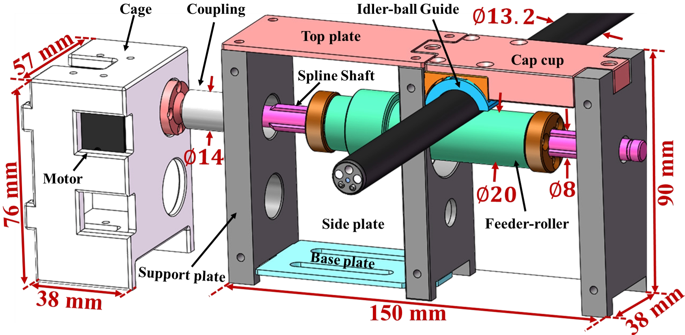
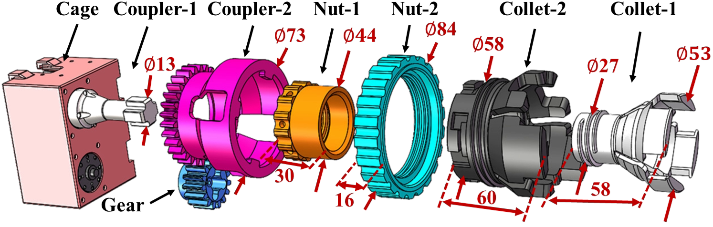
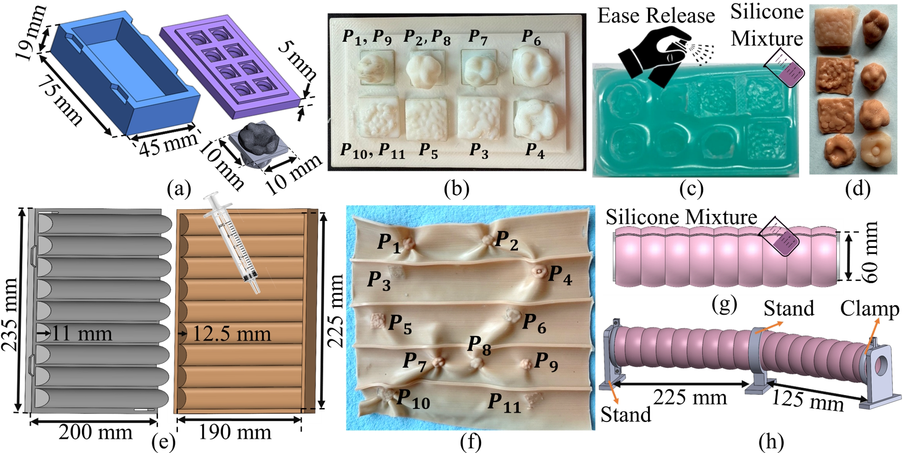

# OpenRC: An Open-Source Robotic Colonoscopy Framework for Multimodal Data Acquisition and Autonomy Research

**MICCAI 2026** &nbsp;·&nbsp; Siddhartha Kapuria, Mohammad Rafiee Javazm, Naruhiko Ikoma, Joga Ivatury, Mohammad Ali Nasseri, Nassir Navab, Farshid Alambeigi

[](https://arxiv.org/abs/2604.03781)
[](https://huggingface.co/datasets/nvidia/PhysicalAI-Robotics-Open-H-Embodiment/tree/main/Endoscopy/ut_austin/arts_lab/colonoscope_lerobot)
[](https://arxiv.org/abs/2509.10735)
[](https://creativecommons.org/licenses/by/4.0/)

OpenRC is an open-source framework that **robotizes a conventional clinical colonoscope without altering its workflow.** A modular robotic platform actuates the scope's existing insertion-tube and steering knobs while simultaneously recording the endoscopic video, operator commands, low-level actuation signals, and the distal-tip pose. The result is a reproducible testbed for studying robotic colonoscopy, imitation/vision-language-action learning, and surgical autonomy. We colelct and release a large, time-aligned multimodal dataset on HuggingFace using this platform. 

This repository provides a higher-level-of-detail overview of the **hardware platform** and the **colon phantom testbed**. Full analytical design, optimization, and fabrication derivations are documented in our companion paper, [arXiv:2509.10735](https://arxiv.org/abs/2509.10735).

---

## System Overview


OpenRC is organized into four interconnected subsystems:

1. **Control System** — operator interface and onboard compute.
2. **Robotic System** — the clip-on actuation hardware (feeding + bending modules).
3. **Video Capture** — clinical imaging chain and frame acquisition.
4. **Environment & Sensing** — the colon phantom and electromagnetic tip tracking.

---

## Hardware Platform

> For the full analytical design, parameter-optimization spaces, and mechanical fabrication of the feeding and bending modules, see the companion paper [arXiv:2509.10735](https://arxiv.org/abs/2509.10735). The summary below is intended as a platform-level overview.

### Control System

Teleoperation is handled by a standard **Xbox controller**, with real-time control and data logging running onboard an **NVIDIA Jetson Orin Nano Super**. A graphical user interface displays the live endoscopic feed and system state, and motor commands are dispatched to the actuators through a **Dynamixel U2D2** serial controller.

| Input | Action |
|-------|--------|
| `R2` (right trigger) | Retraction |
| `L2` (left trigger) | Insertion |
| Analog stick | Bending (steering, X/Y) |
| `L3` (stick press) | Reset / home |

### Robotic System

The robotic system is a retrofit: it clamps onto an unmodified colonoscope and drives the same insertion tube and control knobs a clinician would operate by hand. It comprises two decoupled modules.

#### Feeding Module



The feeding module provides the single insertion/retraction degree of freedom. A motor drives a **spline shaft** coupled to a **feeder-roller** that grips the insertion tube, while an opposing **idler-ball guide** maintains contact pressure and keeps the tube aligned as it is advanced or withdrawn. The module is packaged in a compact rigid cage (≈ 150 × 90 × 38 mm) that mounts at the scope entry point.

#### Bending Module



The bending module actuates the scope's steering (knob) degrees of freedom using a **nested collet-chuck** design. Concentric collets and couplers grip the existing up/down and left/right steering knobs without modification, and gear-driven motors — commanded through the U2D2 controller — rotate them to deflect the distal tip. This preserves the native tendon-driven steering mechanism of the scope while making it programmatically controllable.

### Video Capture

Imaging uses the clinical chain end-to-end: the scope's optics are illuminated and processed by a **video processor & light source**, whose output is digitized by a **frame grabber** and streamed to the compute unit. The endoscopic video is captured at **383 × 396 resolution, 30 fps**.

### Environment & Sensing

Distal-tip localization is provided by an **NDI Aurora electromagnetic (EM) tracker**, yielding 6-DoF tip pose (position + orientation) co-registered with the video and actuation streams. The robotized scope is exercised against a custom **colon phantom** with embedded polyps (below).

---

## Colon Phantom Testbed



Because commercial colonoscopy simulators are designed primarily for navigation training and do not contain detectable polyps, we developed a custom silicone colon phantom with **embedded colorectal cancer (CRC) polyps of varying stages**, enabling end-to-end evaluation of both maneuverability and AI-enabled lesion detection. Fabrication proceeds in two stages: forming the polyps, then casting the colon wall with the polyps embedded.

### Polyp Fabrication

Polyps were designed to span the **Paris classification** of CRC lesion morphologies.

1. **Rigid masters.** High-resolution polyp masters were printed on a Digital Anatomy Printer (Stratasys J750) in Vero PureWhite to capture fine surface texture.
2. **Negative molds.** Each master was used to cast a negative silicone mold inside a 3D-printed container and cap (Prusa i3 MK3S+, ABS).
3. **Silicone casts.** After demolding, the mold surface was treated with Ease Release 200 (Mann Technologies), then filled with a flesh-tone-pigmented silicone mixture (Smooth-On). This yields the final soft polyps — **11 polyps, labeled P1–P11.**

### Colon Phantom Fabrication

The phantom wall is cast using a simple, modular, **unfolded mold** (a flat base mold plus a core cap), avoiding the leakage, complex assembly, and polyp-embedding difficulties of traditional core-based molding. Dimensions follow the reported average human colon (external diameter **D ≈ 60 mm**):

- **Base mold:** nine half-cylinder channels, radius **r = 12.5 mm**, spanning a width **W = 190 mm** (the phantom circumference once wrapped).
- **Core cap:** nine half-cylinders, radius **r = 11 mm**, producing a uniform **1.5 mm wall thickness** against the base mold.

**Process:**

1. Mix Ecoflex 00-30 (Smooth-On, parts A:B = 1:1), pigment flesh-tone, and degas in a vacuum chamber.
2. Dispense ≈ 10 mL into each half-cylinder channel; randomly place the 11 prefabricated polyps on the poured layer (ensuring adhesion while preserving surface texture).
3. Assemble and clamp the core cap to hold the polyps and maintain uniform wall thickness; cure ≈ 4 hours at room temperature.
4. Demold the flat sheet, wrap it around a cylindrical tube, and secure with a holder; seal the seam with Ecoflex 00-35 Fast (Smooth-On) to form a continuous cylinder.
5. Fabricate additional segments and join them with the same procedure to extend length. Each segment is **225 mm** long.

The fully assembled phantom is supported by 3D-printed stands and clamps to form **straight or curved** sections, permanently embedding clinically representative polyps for both navigation and detection studies.

---

## Dataset

The OpenRC dataset is hosted on HuggingFace in **[LeRobot](https://github.com/huggingface/lerobot) format**, under NVIDIA's PhysicalAI Open-H-Embodiment collection:

> **`nvidia/PhysicalAI-Robotics-Open-H-Embodiment`** → [`Endoscopy/ut_austin/arts_lab/colonoscope_lerobot`](https://huggingface.co/datasets/nvidia/PhysicalAI-Robotics-Open-H-Embodiment/tree/main/Endoscopy/ut_austin/arts_lab/colonoscope_lerobot)

| | |
|---|---|
| **Episodes** | 1,894 teleoperated trajectories |
| **Frames** | 2,095,587 (~19.4 hours) |
| **Camera** | 383 × 396 endoscopic video @ 30 fps |
| **Size** | 19.7 GB |
| **Robot type** | Cobra Colonoscope (4-motor tendon-driven flexible endoscope) |
| **Recording** | ROS2 Humble; calibration-based time alignment across streams |
| **Collection** | 5 intermediate-skill operators, 10 structured task variations, Nov 2025 – Jan 2026 |
| **License** | CC BY 4.0 |

**Task variations** span routine navigation, induced failure events, and recovery behaviors.

### Modalities & Schema

- **Endoscopic video** — RGB camera feed (384 × 400 @ 30 fps).
- **NDI Aurora EM tracking** — distal-tip pose.
- **Xbox controller** — operator teleoperation inputs.

| Key | dtype / shape | Description |
|-----|---------------|-------------|
| `observation.images.endoscope` | video `[396, 383, 3]` | Endoscopic RGB camera feed (AV1 / yuv420p) |
| `observation.state` | int32 `[3]` | Motor positions: `motor_1`, `motor_2`, `motor_3` |
| `observation.ndi_cartesian_absolute` | float32 `[7]` | Absolute tip pose in NDI frame: `x, y, z, qx, qy, qz, qw` |
| `observation.ndi_cartesian_relative` | float32 `[6]` | Relative tip motion: `dx, dy, dz, droll, dpitch, dyaw` |
| `action` | float32 `[4]` | `bend_x`, `bend_y`, `insertion`, `home` (ranges: `[-1, 1]` for bend/insertion, `[0, 1]` for home) |

### Quickstart

The dataset uses **LeRobot format v2.1**, which requires **`lerobot==0.33`**. Download the subset directly with the HuggingFace Hub client:

```bash
pip install huggingface_hub "lerobot==0.33"
```

```python
from huggingface_hub import snapshot_download

local_dir = snapshot_download(
    repo_id="nvidia/PhysicalAI-Robotics-Open-H-Embodiment",
    repo_type="dataset",
    allow_patterns="Endoscopy/ut_austin/arts_lab/colonoscope_lerobot/*",
)
print("Downloaded to:", local_dir)
```

Then load it with the LeRobot API (pointing at the downloaded subfolder):

```python
from lerobot.common.datasets.lerobot_dataset import LeRobotDataset

dataset = LeRobotDataset(
    repo_id="nvidia/PhysicalAI-Robotics-Open-H-Embodiment",
    root=f"{local_dir}/Endoscopy/ut_austin/arts_lab/colonoscope_lerobot",
)

print(dataset)
sample = dataset[0]            # a single frame with video + state + action
print(sample.keys())
```

See the [dataset card](https://huggingface.co/datasets/nvidia/PhysicalAI-Robotics-Open-H-Embodiment/blob/main/Endoscopy/ut_austin/arts_lab/colonoscope_lerobot/README.md) for the authoritative feature schema and any version-specific loading notes.

---

## Release Roadmap

- [ ] Release the open-hardware package: **STL files** (feeding module, bending module, and phantom molds/stands), a **Bill of Materials** (Dynamixel motors, U2D2, frame grabber, NDI Aurora, video processor/light source, fasteners), and an **assembly guide**.

---

## Citation

If you use OpenRC or its dataset, please cite:

```bibtex
@inproceedings{kapuria2026openrc,
  title     = {OpenRC: An Open-Source Robotic Colonoscopy Framework for Multimodal Data Acquisition and Autonomy Research},
  author    = {Kapuria, Siddhartha and Rafiee Javazm, Mohammad and Ikoma, Naruhiko and Ivatury, Joga and Nasseri, Mohammad Ali and Navab, Nassir and Alambeigi, Farshid},
  booktitle = {Medical Image Computing and Computer Assisted Intervention (MICCAI)},
  year      = {2026},
  eprint    = {2604.03781},
  archivePrefix = {arXiv},
  % TODO: update pages/publisher/DOI when the proceedings are published
}
```

The mechanical design and modeling of the feeding and bending modules:

```bibtex
@article{rafieejavazm2025endoscopy,
  title   = {Analytical Design and Development of a Modular and Intuitive Framework for Robotizing and Enhancing the Existing Endoscopic Procedures},
  author  = {Rafiee Javazm, Mohammad and Kulkarni, Yash and Xue, Jiaqi and Ikoma, Naruhiko and Alambeigi, Farshid},
  journal = {arXiv preprint arXiv:2509.10735},
  year    = {2025},
}
```

---

## License & Acknowledgements

The dataset is released under **[CC BY 4.0](https://creativecommons.org/licenses/by/4.0/)** and hosted within NVIDIA's PhysicalAI Open-H-Embodiment collection. Hardware and phantom development were carried out at the **Advanced Robotic Technologies for Surgery (ARTS) Lab, The University of Texas at Austin.**
