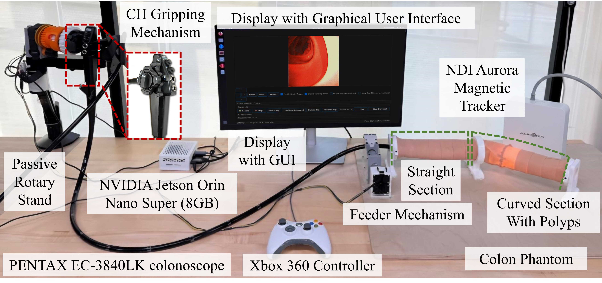
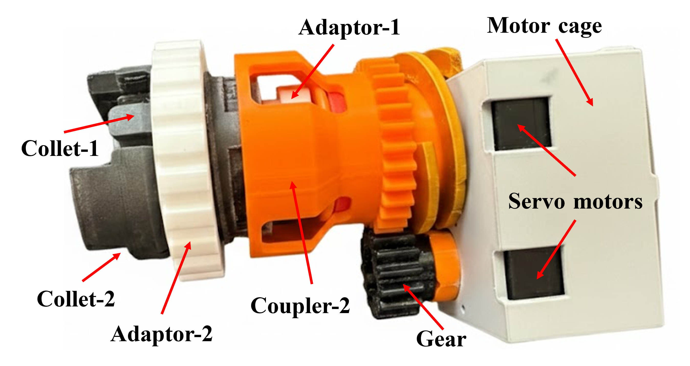
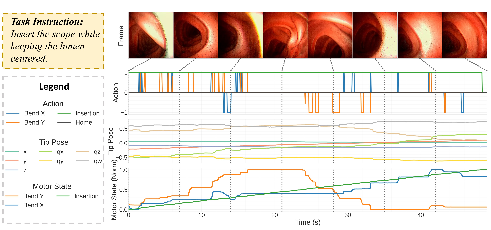

# OpenRC: An Open-Source Robotic Colonoscopy Framework for Multimodal Data Acquisition and Autonomy Research

**MICCAI 2026** &nbsp;·&nbsp; Siddhartha Kapuria, Mohammad Rafiee Javazm, Naruhiko Ikoma, Joga Ivatury, Mohammad Ali Nasseri, Nassir Navab, Farshid Alambeigi

[](https://arxiv.org/abs/2604.03781)
[](https://huggingface.co/datasets/nvidia/PhysicalAI-Robotics-Open-H-Embodiment/tree/main/Endoscopy/ut_austin/arts_lab/colonoscope_lerobot)
[](https://creativecommons.org/licenses/by/4.0/)

OpenRC is an open-source framework that **robotizes a conventional clinical colonoscope without altering its workflow.** A modular robotic platform actuates the scope's existing insertion-tube and steering knobs while simultaneously recording the endoscopic video, operator commands, low-level actuation signals, and the distal-tip pose. The result is a reproducible testbed for studying robotic colonoscopy, imitation/vision-language-action learning, and surgical autonomy. 

This repository provides a higher-level-of-detail overview of the **hardware platform** and the **colon phantom testbed**. Full analytical design, optimization, and fabrication derivations are documented in our companion paper, [arXiv:2509.10735](https://arxiv.org/abs/2509.10735).

This repository also includes the OpenRC dataset release accompanying this platform. The dataset consists of synchronized multimodal trajectories collected using this platform on real colon phantoms, spanning navigation, scanning, and failure/recovery scenarios.

---

## System Overview


OpenRC is organized into four interconnected subsystems:

1. **Control System** — operator interface and onboard compute.
2. **Robotic System** — the clip-on actuation hardware (feeding + bending modules).
3. **Video Capture** — clinical imaging chain and frame acquisition.
4. **Environment & Sensing** — the colon phantom and electromagnetic tip tracking.

---

## Experimental Setup



The complete benchtop testbed. A **PENTAX EC-3840LK colonoscope** is held on a passive rotary stand, with its distal end gripped by the **CH (collet-chuck) bending mechanism** and its insertion tube driven by the **feeder mechanism**. An **Xbox 360 controller** teleoperates the scope through the **NVIDIA Jetson Orin Nano Super (8 GB)**, which also runs the **GUI** shown on the display. The scope is navigated through a custom **colon phantom** while the **NDI Aurora magnetic tracker** records 6-DoF distal-tip pose.

---

## Hardware Platform

OpenRC is a **retrofit**: it clamps onto an unmodified clinical colonoscope and drives the same insertion tube and steering knobs a clinician would operate by hand. Two decoupled, 3D-printable modules provide the actuation, while teleoperation, compute, and synchronized recording run onboard an NVIDIA Jetson.

| | |
|---|---|
| **Compute** | NVIDIA Jetson Orin Nano Super (8 GB) |
| **Control** | Xbox controller → ROS2 Humble → Dynamixel U2D2 |
| **Feeding module** | 1-DoF insertion/retraction via a motor-driven spline shaft and feeder-roller |
| **Bending module** | Steering via a nested collet-chuck gripping the scope's existing knobs |
| **Imaging** | Clinical video processor + frame grabber, 383 × 396 @ 30 fps |
| **Sensing** | NDI Aurora EM tracker, 6-DoF distal-tip pose |
| **Scope** | PENTAX EC-3840LK (unmodified) |

The two fabricated actuation modules:


*Feeding module — a motor drives the spline shaft through a flexible coupling, advancing the scope's insertion tube.*



*Bending module — nested collets clamp onto the concentric steering knobs and are driven through a gear train to deflect the distal tip.*

> **Further details are provided in [`docs/`](docs/):** mechanical design and CAD ([Hardware Platform](docs/hardware.md)), the ROS2 control architecture ([Software & ROS2 Stack](docs/software.md)), and the phantom build ([Colon Phantom Fabrication](docs/phantom-fabrication.md)). For the analytical design and optimization, see the companion paper [arXiv:2509.10735](https://arxiv.org/abs/2509.10735).

---

## Documentation

| Document | Contents |
|----------|----------|
| [Hardware Platform](docs/hardware.md) | Control system, feeding/bending modules (CAD + dimensions), video capture, sensing |
| [Software & ROS2 Stack](docs/software.md) | ROS2 node graph, topics, and control/recording architecture (implementation details) |
| [Colon Phantom Fabrication](docs/phantom-fabrication.md) | Polyp and colon-wall molding/casting procedure |
| [Bill of Materials](docs/bill-of-materials.md) | Components, part numbers, and suppliers |
| [CAD & Assembly Files](docs/assembly.md) | STEP assembly exports and STL files for printable parts |

---

## Dataset

The OpenRC dataset is hosted on HuggingFace in **[LeRobot](https://github.com/huggingface/lerobot) format**, under NVIDIA's PhysicalAI Open-H-Embodiment collection:

> **`nvidia/PhysicalAI-Robotics-Open-H-Embodiment`** → [`Endoscopy/ut_austin/arts_lab/colonoscope_lerobot`](https://huggingface.co/datasets/nvidia/PhysicalAI-Robotics-Open-H-Embodiment/tree/main/Endoscopy/ut_austin/arts_lab/colonoscope_lerobot)

| | |
|---|---|
| **Episodes** | 1,894 teleoperated trajectories |
| **Frames** | 2,095,587 (~19.4 hours) |
| **Camera** | 383 × 396 endoscopic video @ 30 fps |
| **Size** | 19.7 GB |
| **Recording** | ROS2 Humble; calibration-based time alignment across streams |
| **Collection** | 5 intermediate-skill operators, 10 structured task variations, Nov 2025 – Jan 2026 |
| **License** | CC BY 4.0 |

**Task variations** span routine navigation, induced failure events, and recovery behaviors.

### Example Episode



A representative episode (`episode_000370`) for the task *"Insert the scope while keeping the lumen centered."* The top row shows sampled endoscopic frames; below, the synchronized operator **action** (bend X/Y, insertion, home), 7-DoF **tip pose** from the EM tracker, and low-level **motor state** are plotted over the episode timeline — illustrating how all streams are time-aligned within each trajectory.

### Modalities & Schema

- **Endoscopic video** — RGB camera feed (384 × 383 @ 30 fps).
- **NDI Aurora EM tracking** — distal-tip pose.
- **Xbox controller** — operator teleoperation inputs.

| Key | dtype / shape | Description |
|-----|---------------|-------------|
| `observation.images.endoscope` | video `[396, 383, 3]` | Endoscopic RGB camera feed (AV1 / yuv420p) |
| `observation.state` | int32 `[3]` | Motor positions: `motor_1`, `motor_2`, `motor_3` |
| `observation.ndi_cartesian_absolute` | float32 `[7]` | Absolute tip pose in NDI frame: `x, y, z, qx, qy, qz, qw` |
| `observation.ndi_cartesian_relative` | float32 `[6]` | Relative tip motion: `dx, dy, dz, droll, dpitch, dyaw` |
| `action` | float32 `[4]` | `bend_x`, `bend_y`, `insertion`, `home` (ranges: `[-1, 1]` for bend/insertion, `[0, 1]` for home) |

### Quickstart

The dataset uses **LeRobot format v2.1**, which requires **`lerobot==0.33`**.

1. Install `torch` by following the [official PyTorch installation instructions](https://pytorch.org/get-started/locally/).
2. Install the remaining dataset and visualization dependencies:

```bash
pip install huggingface_hub "lerobot==0.33" numpy tqdm rerun
```

3. Download the dataset subset from HuggingFace:

```python
from huggingface_hub import snapshot_download

local_dir = snapshot_download(
    repo_id="nvidia/PhysicalAI-Robotics-Open-H-Embodiment",
    repo_type="dataset",
    allow_patterns="Endoscopy/ut_austin/arts_lab/colonoscope_lerobot/*",
)
print("Downloaded to:", local_dir)
```

4. Load it with the LeRobot API from the downloaded subfolder:

```python
from lerobot.common.datasets.lerobot_dataset import LeRobotDataset

dataset = LeRobotDataset(
    repo_id="nvidia/PhysicalAI-Robotics-Open-H-Embodiment",
    root=f"{local_dir}/Endoscopy/ut_austin/arts_lab/colonoscope_lerobot",
)

print(dataset)
sample = dataset[0]            # a single frame with video + state + action
print(sample.keys())
```

### Visualization

The repository includes [`lerobot_dataset_viz.py`](lerobot_dataset_viz.py), a small Rerun-based viewer for inspecting dataset episodes frame-by-frame.

Example:

```bash
python lerobot_dataset_viz.py \
    --repo-id nvidia/PhysicalAI-Robotics-Open-H-Embodiment \
    --episode-index 370 \
    --root /path/to/snapshot_download/Endoscopy/ut_austin/arts_lab/colonoscope_lerobot
```

By default the script opens a local Rerun viewer. Pass `--save 1 --output-dir path/to/dir` to write an `.rrd` file instead, or use `--mode distant` to stream from a remote machine.

See the [dataset card](https://huggingface.co/datasets/nvidia/PhysicalAI-Robotics-Open-H-Embodiment/blob/main/Endoscopy/ut_austin/arts_lab/colonoscope_lerobot/README.md) for the authoritative feature schema and any version-specific loading notes.

---

## Release Roadmap

- [x] Dataset release (HuggingFace, LeRobot format).
- [x] Hardware, software, and phantom-fabrication documentation ([`docs/`](docs/)).
- [x] CAD release for feeding and bending modules: STEP assembly exports and STL files for printable parts.
- [ ] Complete the [Bill of Materials](docs/bill-of-materials.md) with remaining phantom-material details.

---

## Citation

If you use OpenRC or its dataset, please cite:

```bibtex
@inproceedings{kapuria2026openrc,
  title     = {OpenRC: An Open-Source Robotic Colonoscopy Framework for Multimodal Data Acquisition and Autonomy Research},
  author    = {Kapuria, Siddhartha and Rafiee Javazm, Mohammad and Ikoma, Naruhiko and Ivatury, Joga and Nasseri, Mohammad Ali and Navab, Nassir and Alambeigi, Farshid},
  booktitle = {Medical Image Computing and Computer Assisted Intervention (MICCAI)},
  year      = {2026},
  eprint    = {2604.03781},
  archivePrefix = {arXiv},
  % TODO: update pages/publisher/DOI when the proceedings are published
}
```

The mechanical design and modeling of the feeding and bending modules:

```bibtex
@article{rafieejavazm2025endoscopy,
  title   = {Analytical Design and Development of a Modular and Intuitive Framework for Robotizing and Enhancing the Existing Endoscopic Procedures},
  author  = {Rafiee Javazm, Mohammad and Kulkarni, Yash and Xue, Jiaqi and Ikoma, Naruhiko and Alambeigi, Farshid},
  journal = {arXiv preprint arXiv:2509.10735},
  year    = {2025},
}
```

---

## License & Acknowledgements

The dataset is released under **[CC BY 4.0](https://creativecommons.org/licenses/by/4.0/)** and hosted within NVIDIA's PhysicalAI Open-H-Embodiment collection. Hardware and phantom development were carried out at the **Advanced Robotic Technologies for Surgery (ARTS) Lab, The University of Texas at Austin.**
