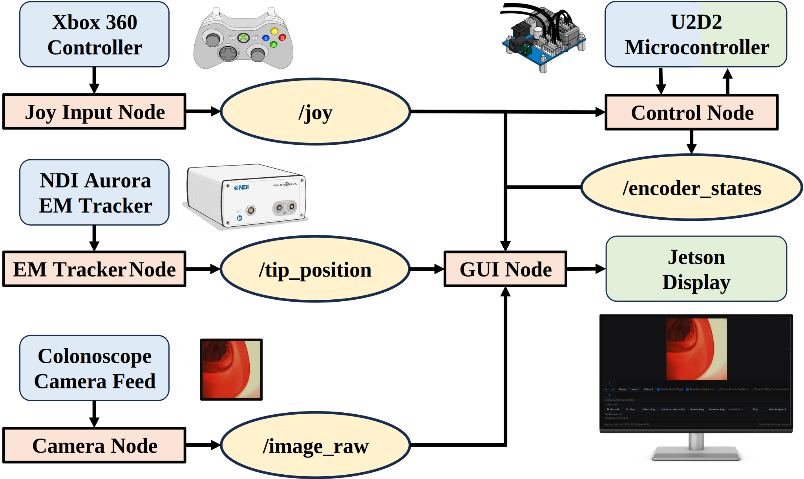

# Software & ROS2 Stack

[← Back to README](../README.md)

The control software is implemented as a **ROS2 Humble** stack running on the Jetson Orin Nano Super. Each hardware interface and processing step is a separate node, communicating over standard topics. This node-based decomposition is what enables synchronized, multi-stream recording: every stream is timestamped and aligned (calibration-based time alignment across topics) to produce the dataset trajectories.

## Nodes & Topics

| Node | Role | Publishes / Subscribes |
|------|------|------------------------|
| **Joy Input Node** | Reads the Xbox controller | publishes `/joy` |
| **Control Node** | Maps operator commands to motor targets; dispatches them through the U2D2 to the actuator microcontroller | subscribes `/joy`; reads back `encoder_states` |
| **Camera Node** | Grabs frame-grabber output | publishes `image_raw` |
| **NDI Aurora Node** | Streams distal-tip pose from the EM tracker | publishes tip `position` |
| **GUI Node** | Renders the live operator display | subscribes to video, motor state, and tip-pose topics |
